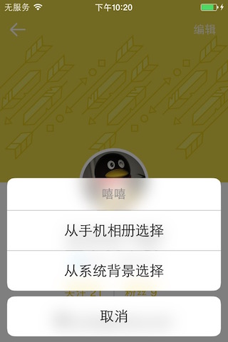
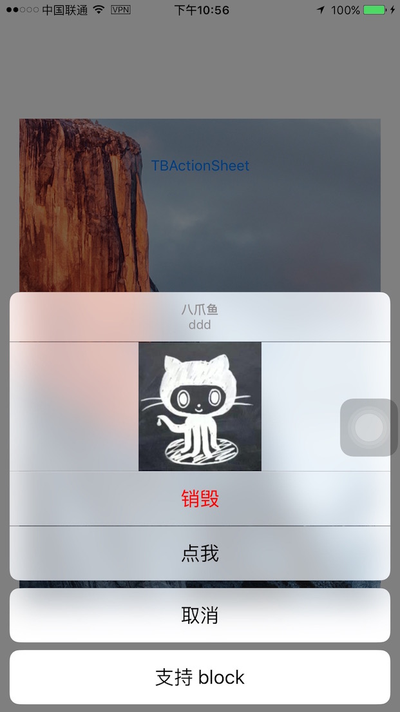

# TBActionSheet

[](https://travis-ci.org/yulingtianxia/TBActionSheet)
[](http://cocoapods.org/pods/TBActionSheet)
[](http://cocoapods.org/pods/TBActionSheet)
[](http://cocoapods.org/pods/TBActionSheet)

TBActionSheet is a custom action sheet. The default style is iOS9, you can make your own style.  

**TBActionSheet supports autorotation**, but there is some bugs on iOS7 :(

Here is a gif showing TBActionSheet's powerful individuation:


This is the iOS9 style of `TBActionSheet` running on iOS7&iPhone 4s:



You can also add your custom `UIView` under the title of `TBActionSheet`:



This repo also include `TBAlertController`, which unifies `UIAlertController`, `UIAlertView`, and `UIActionSheet`. For more infomation about `TBAlertController`, please visit [this post](http://yulingtianxia.com/blog/2015/11/13/Summary-of-the-first-month-in-the-internship-of-Tencent/) of my blog.

BTW, TBActionSheet also suppots BLOCK now!

##Installation
###CocoaPods

TBActionSheet is available through [CocoaPods](http://cocoapods.org). To install
it, simply add the following line to your Podfile:

```ruby
pod "TBActionSheet"
```

###Manual

Just drag the "Source" document folder into your project.

##Usage

###TLDR

To let TBActionSheet looks like WeChat style, you can set these properties of `TBActionShet` or it's `UIAppearance` like this :
```
sheetWidth = MIN(kScreenWidth, kScreenHeight);
backgroundTransparentEnabled = NO;
rectCornerRadius = 0;
``` 

### More than what you want

The base usage is same to `UIActionSheet`. You can just replace `UIActionSheet` with `TBActionSheet`. If you want to customize your action sheet, just configure some properties. I believe the header file can tell you much more than me. 

```
@interface TBActionSheet : UIView
@property(nullable,nonatomic,weak) id<TBActionSheetDelegate> delegate;
@property(nonatomic,copy)  NSString * _Nullable  title;
@property(nonatomic,copy)  NSString * _Nullable  message;
/**
 *   标记藏于 ActionSheet 下面的 UIWindow
 */
@property (weak, nonatomic, readonly) UIWindow *previousKeyWindow;

- (instancetype)initWithTitle:(nullable NSString *)title delegate:(nullable id <TBActionSheetDelegate>)delegate cancelButtonTitle:(nullable NSString *)cancelButtonTitle destructiveButtonTitle:(nullable NSString *)destructiveButtonTitle otherButtonTitles:(nullable NSString *)otherButtonTitles, ... NS_REQUIRES_NIL_TERMINATION;
- (instancetype)initWithTitle:(nullable NSString *)title message:(nullable NSString *)message delegate:(nullable id <TBActionSheetDelegate>)delegate cancelButtonTitle:(nullable NSString *)cancelButtonTitle destructiveButtonTitle:(nullable NSString *)destructiveButtonTitle otherButtonTitles:(nullable NSString *)otherButtonTitles, ... NS_REQUIRES_NIL_TERMINATION;
- (instancetype)initWithFrame:(CGRect)frame NS_UNAVAILABLE;

// adds a button with the title. returns the index (0 based) of where it was added. buttons are displayed in the order added except for the
// destructive and cancel button which will be positioned based on HI requirements. buttons cannot be customized.
- (NSInteger)addButtonWithTitle:(nullable NSString *)title;
- (NSInteger)addButtonWithTitle:(nullable NSString *)title style:(TBActionButtonStyle)style;    // returns index of button. 0 based.
- (NSInteger)addButtonWithTitle:(nullable NSString *)title style:(TBActionButtonStyle)style handler:(void (^ __nullable)( TBActionButton * button))handler;
- (nullable NSString *)buttonTitleAtIndex:(NSInteger)buttonIndex;
@property(nonatomic,readonly) NSInteger numberOfButtons;
@property(nonatomic) NSInteger cancelButtonIndex;      // if the delegate does not implement -actionSheetCancel:, we pretend this button was clicked on. default is -1
@property(nonatomic) NSInteger destructiveButtonIndex; // sets destructive (red) button. -1 means none set. default is -1. ignored if only one button

@property(nonatomic,readonly) NSInteger firstOtherButtonIndex;	// -1 if no otherButtonTitles or initWithTitle:... not used
@property(nonatomic,readonly,getter=isVisible) BOOL visible;

/**
 *  显示 ActionSheet
 */
- (void)show;
- (void)showInView:(nullable UIView *)view;

//custom UI
/**
 *  按钮高度
 */
@property(nonatomic) CGFloat buttonHeight UI_APPEARANCE_SELECTOR;
/**
 *  actionsheet下方的 y 轴位移，向下为正，非负值无效，默认值为 -8
 */
@property(nonatomic) CGFloat offsetY UI_APPEARANCE_SELECTOR;
/**
 *  标题 UILabel
 */
@property(nonatomic,strong,nullable,readonly) UILabel *titleLabel;
/**
 *  Message UILabel
 */
@property (nonatomic,strong,nullable,readonly) UILabel *messageLabel;
/**
 *  文字颜色
 */
@property(nonatomic,strong) UIColor *tintColor UI_APPEARANCE_SELECTOR;
@property(nonatomic,strong) UIColor *destructiveButtonColor UI_APPEARANCE_SELECTOR;
@property(nonatomic,strong) UIColor *cancelButtonColor UI_APPEARANCE_SELECTOR;
/**
 *  分割线颜色
 */
@property(nonatomic,strong) UIColor *separatorColor UI_APPEARANCE_SELECTOR;
/**
 *  按钮字体
 */
@property(nonatomic,strong) UIFont *buttonFont UI_APPEARANCE_SELECTOR;
/**
 *  sheet 的宽度，也就是按钮宽度
 */
@property(nonatomic) CGFloat sheetWidth UI_APPEARANCE_SELECTOR;
/**
 *  是否让背景透明
 */
@property(nonatomic, getter=isBackgroundTransparentEnabled) NSInteger backgroundTransparentEnabled UI_APPEARANCE_SELECTOR;
/**
 *  是否启用毛玻璃效果
 */
@property(nonatomic, getter=isBlurEffectEnabled) NSInteger blurEffectEnabled UI_APPEARANCE_SELECTOR;
/**
 *  矩形圆角半径
 */
@property(nonatomic,assign) CGFloat rectCornerRadius UI_APPEARANCE_SELECTOR;
/**
 *  ActionSheet 的环境色，如果 useBlurEffect 为 YES，在 iOS7 下会与其效果混合。
 */
@property(nonatomic,strong) UIColor *ambientColor UI_APPEARANCE_SELECTOR;
/**
 *  自定义视图
 */
@property(nonatomic,strong,nullable) UIView *customView;
/**
 *  动画持续时长
 */
@property(nonatomic,assign) NSTimeInterval animationDuration UI_APPEARANCE_SELECTOR;
/**
 *  动画弹簧效果衰弱比例，值为 1 时无摆动，值越接近 0 摆动越大
 */
@property(nonatomic,assign) CGFloat animationDampingRatio UI_APPEARANCE_SELECTOR;
/**
 *  动画弹簧效果初速度。如果动画总距离为 200 点，想让初速度为每秒 100 点，那么将值设为 0.5
 */
@property(nonatomic,assign) CGFloat animationVelocity UI_APPEARANCE_SELECTOR;
/**
 *  重置布局
 */
- (void)setUpLayout;
/**
 *  重置毛玻璃效果、圆角、背景颜色等风格
 */
- (void)setUpStyle;
/**
 *  重置容器 frame
 */
- (void)setUpContainerFrame;
@end
```

There is also an example project for `TBActionSheet`.

## Author

yulingtianxia, yulingtianxia@gmail.com

## License

TBActionSheet is available under the MIT license. See the LICENSE file for more info.